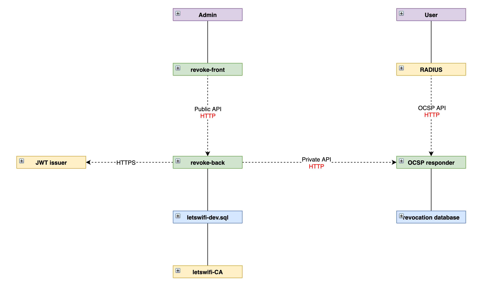

# revoke

This repo contains an OCSP server with a front end for managing certificate revocations. The current state of the system is illustrated below.

<p align='center'>
    
</p>

## Test setup

The following files are required:

```
jwt.crt
jwt.key
back/letswifi-dev.sqlite
ocsp/certs/ca.pem
ocsp/certs/responder.pem
ocsp/certs/responder_key.pem
```

Initialize and start all containers using:

```
docker-compose up -d --build
./jwt-setup
./verify-setup
docker-compose restart
```

`jwt-setup` initializes the `jwt` container with an example `.htpasswd` file and signing keypair, which is copied to `back`. `./verify-setup` outputs nothing if all is correct. Lastly the containers are restarted so that `jwt` recognizes the new signing key.
